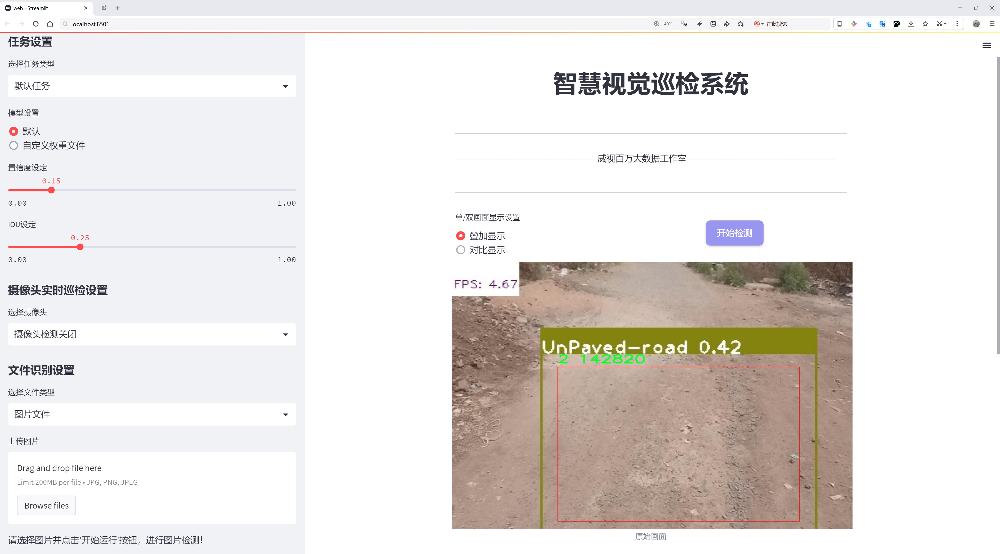
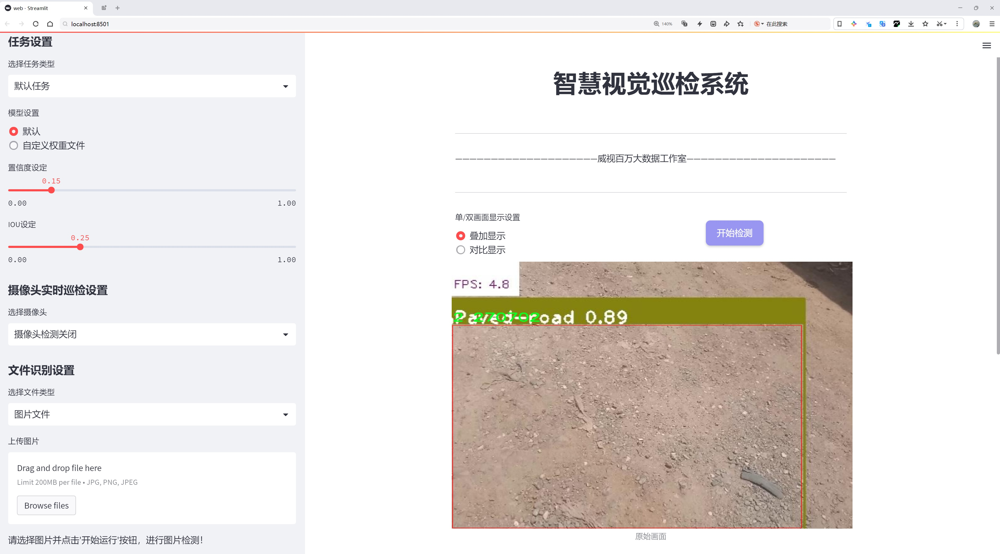
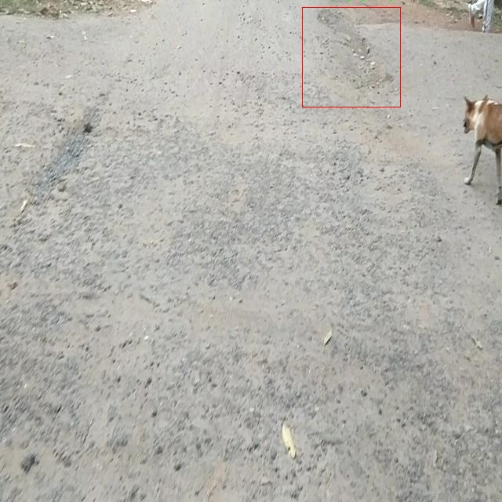
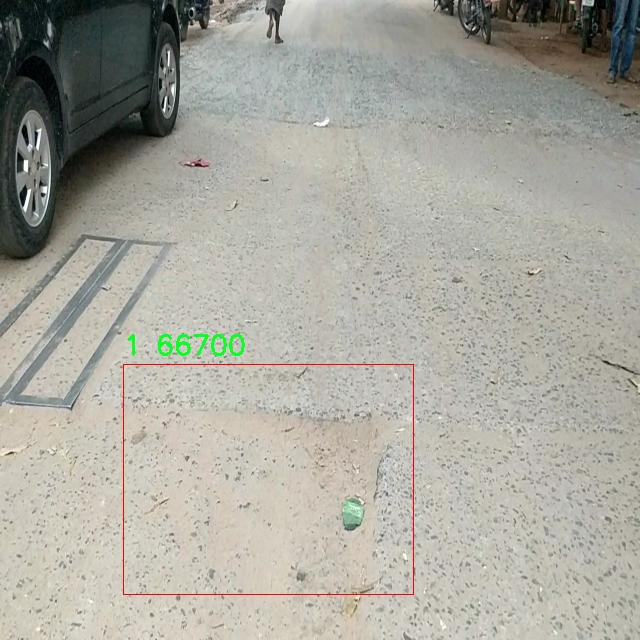
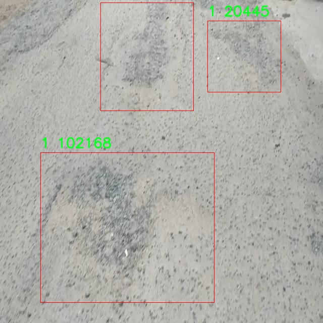
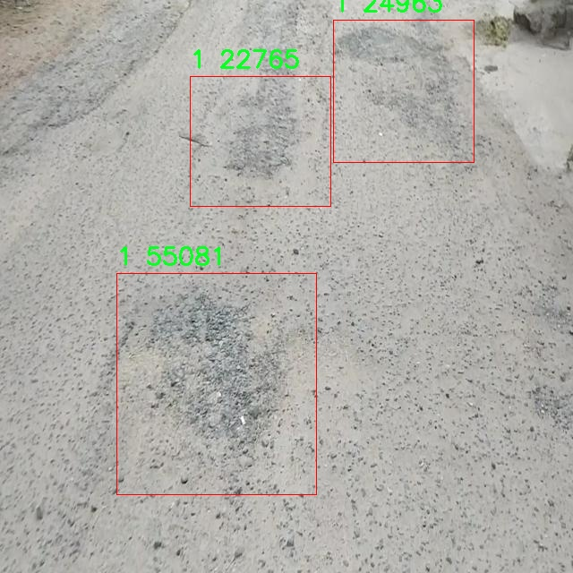
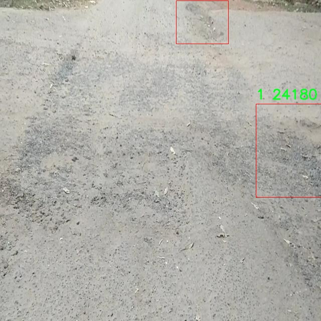

# 道路坑洼检测检测系统源码分享
 # [一条龙教学YOLOV8标注好的数据集一键训练_70+全套改进创新点发刊_Web前端展示]

### 1.研究背景与意义

项目参考[AAAI Association for the Advancement of Artificial Intelligence](https://gitee.com/qunmasj/projects)

项目来源[AACV Association for the Advancement of Computer Vision](https://kdocs.cn/l/cszuIiCKVNis)

研究背景与意义

随着城市化进程的加快，城市道路的使用频率不断增加，随之而来的道路损坏问题日益严重，尤其是道路坑洼的出现，给交通安全和行车舒适性带来了显著影响。道路坑洼不仅影响车辆的正常行驶，还可能导致交通事故的发生，进而对人们的生命财产安全构成威胁。因此，及时、准确地检测和修复道路坑洼成为了城市管理和交通安全保障的重要任务。传统的道路检测方法往往依赖人工巡查，效率低下且容易受到主观因素的影响，难以满足现代城市管理的需求。

近年来，随着计算机视觉和深度学习技术的迅猛发展，基于图像处理的自动化检测方法逐渐成为研究热点。YOLO（You Only Look Once）系列模型以其高效的实时目标检测能力，广泛应用于各类物体检测任务中。YOLOv8作为该系列的最新版本，结合了更先进的网络结构和优化算法，具备了更强的特征提取能力和更快的推理速度，为道路坑洼检测提供了新的技术路径。然而，现有的YOLOv8模型在特定应用场景下仍存在一定的局限性，如对小目标的检测精度不足、环境光照变化对检测结果的影响等。因此，针对道路坑洼检测的特定需求，对YOLOv8进行改进和优化，显得尤为重要。

本研究旨在基于改进的YOLOv8模型，构建一个高效的道路坑洼检测系统。为此，我们将利用一个包含4300张图像的数据集，该数据集涵盖了三类不同类型的道路坑洼。这一数据集的丰富性和多样性为模型的训练和验证提供了良好的基础，使得检测系统能够在多种环境和条件下进行有效的学习和适应。通过对数据集的深入分析，我们将针对不同类型的坑洼特征，设计相应的改进策略，以提升模型在实际应用中的表现。

本研究的意义不仅在于提升道路坑洼的检测精度和效率，更在于为城市交通管理提供一种智能化的解决方案。通过自动化的检测系统，城市管理者可以实时获取道路状况信息，及时采取修复措施，降低交通事故的发生率，提高道路的使用安全性。此外，该系统的成功应用还可以为其他城市基础设施的智能监测提供借鉴，推动城市管理的数字化转型。

综上所述，基于改进YOLOv8的道路坑洼检测系统的研究，不仅具有重要的理论价值，也具备广泛的实际应用前景。通过本研究，我们期望能够为道路坑洼的智能检测提供新的思路和方法，为城市交通安全和管理效率的提升贡献力量。

### 2.图片演示






##### 注意：由于此博客编辑较早，上面“2.图片演示”和“3.视频演示”展示的系统图片或者视频可能为老版本，新版本在老版本的基础上升级如下：（实际效果以升级的新版本为准）

  （1）适配了YOLOV8的“目标检测”模型和“实例分割”模型，通过加载相应的权重（.pt）文件即可自适应加载模型。

  （2）支持“图片识别”、“视频识别”、“摄像头实时识别”三种识别模式。

  （3）支持“图片识别”、“视频识别”、“摄像头实时识别”三种识别结果保存导出，解决手动导出（容易卡顿出现爆内存）存在的问题，识别完自动保存结果并导出到tempDir中。

  （4）支持Web前端系统中的标题、背景图等自定义修改，后面提供修改教程。

  另外本项目提供训练的数据集和训练教程,暂不提供权重文件（best.pt）,需要您按照教程进行训练后实现图片演示和Web前端界面演示的效果。

### 3.视频演示

[3.1 视频演示](https://www.bilibili.com/video/BV1xysDeGEZ4/)

### 4.数据集信息展示

##### 4.1 本项目数据集详细数据（类别数＆类别名）

nc: 3
names: ['0', '1', '2']


##### 4.2 本项目数据集信息介绍

数据集信息展示

在道路维护和交通安全领域，及时检测和修复道路坑洼是至关重要的。为此，我们构建了一个专门用于训练改进YOLOv8的道路坑洼检测系统的数据集，命名为“potholesdetection”。该数据集的设计旨在提供丰富的样本，以提高模型在实际应用中的准确性和鲁棒性。数据集包含了多种不同类型的道路坑洼样本，涵盖了不同的环境、光照条件和路面材质，以确保模型能够在各种情况下有效识别和分类坑洼。

“potholesdetection”数据集的类别数量为三，分别用数字“0”、“1”和“2”进行标识。这些类别的划分是基于道路坑洼的特征和严重程度进行的，旨在帮助模型更好地理解和区分不同类型的坑洼。类别“0”代表轻微的坑洼，通常是表面裂缝或小凹陷，对车辆的影响相对较小；类别“1”则表示中等程度的坑洼，这类坑洼可能会对行驶安全造成一定的威胁；而类别“2”则是严重的坑洼，通常深度较大，容易导致车辆损坏或引发交通事故。因此，通过对这三类坑洼的有效识别，模型不仅能够提高检测的准确性，还能为后续的道路维护提供重要的决策依据。

数据集的构建过程经过了严格的筛选和标注。我们从多个城市和乡村地区收集了大量的道路坑洼图像，确保样本的多样性和代表性。在数据采集过程中，使用了高分辨率的相机，以捕捉坑洼的细节特征。随后，经过专业人员的标注和分类，确保每一张图像都被准确地标记为相应的类别。这一过程不仅提高了数据集的质量，也为模型的训练提供了坚实的基础。

为了进一步增强数据集的实用性，我们还进行了数据增强处理，包括旋转、缩放、翻转和颜色调整等操作。这些技术手段有效地扩展了数据集的规模，使得模型在训练过程中能够接触到更多样化的样本，从而提高其泛化能力。通过这种方式，我们希望模型能够在面对不同环境和条件下的坑洼时，依然保持高效的检测性能。

在数据集的使用过程中，我们将其分为训练集、验证集和测试集，以便于模型的训练和评估。训练集用于模型的学习，验证集用于调整模型参数，而测试集则用于最终的性能评估。通过这种科学的划分方式，我们能够全面地评估模型在不同阶段的表现，确保其在实际应用中的可靠性。

总之，“potholesdetection”数据集的构建不仅为改进YOLOv8的道路坑洼检测系统提供了坚实的数据基础，也为未来的研究和应用开辟了新的方向。随着技术的不断进步，我们期待该数据集能够在更广泛的领域中发挥作用，为提升道路安全和交通管理水平贡献力量。











### 5.全套项目环境部署视频教程（零基础手把手教学）

[5.1 环境部署教程链接（零基础手把手教学）](https://www.ixigua.com/7404473917358506534?logTag=c807d0cbc21c0ef59de5)


[5.2 安装Python虚拟环境创建和依赖库安装视频教程链接（零基础手把手教学）](https://www.ixigua.com/7404474678003106304?logTag=1f1041108cd1f708b01a)

### 6.手把手YOLOV8训练视频教程（零基础小白有手就能学会）

[6.1 手把手YOLOV8训练视频教程（零基础小白有手就能学会）](https://www.ixigua.com/7404477157818401292?logTag=d31a2dfd1983c9668658)

### 7.70+种全套YOLOV8创新点代码加载调参视频教程（一键加载写好的改进模型的配置文件）

[7.1 70+种全套YOLOV8创新点代码加载调参视频教程（一键加载写好的改进模型的配置文件）](https://www.ixigua.com/7404478314661806627?logTag=29066f8288e3f4eea3a4)

### 8.70+种全套YOLOV8创新点原理讲解（非科班也可以轻松写刊发刊，V10版本正在科研待更新）

由于篇幅限制，每个创新点的具体原理讲解就不一一展开，具体见下列网址中的创新点对应子项目的技术原理博客网址【Blog】：


[8.1 70+种全套YOLOV8创新点原理讲解链接](https://gitee.com/qunmasj/good)

### 9.系统功能展示（检测对象为举例，实际内容以本项目数据集为准）

图9.1.系统支持检测结果表格显示

  图9.2.系统支持置信度和IOU阈值手动调节

  图9.3.系统支持自定义加载权重文件best.pt(需要你通过步骤5中训练获得)

  图9.4.系统支持摄像头实时识别

  图9.5.系统支持图片识别

  图9.6.系统支持视频识别

  图9.7.系统支持识别结果文件自动保存

  图9.8.系统支持Excel导出检测结果数据


### 10.原始YOLOV8算法原理

原始YOLOv8算法原理

YOLOv8算法作为目标检测领域的最新代表，继承并发展了YOLO系列算法的核心思想，旨在实现高效、准确的目标检测。其设计理念基于将目标检测任务转化为回归问题的框架，利用单一神经网络同时预测目标的位置和类别。这一方法的创新性在于，它通过将复杂的目标检测过程简化为一个端到端的回归问题，从而显著提高了检测速度和精度。

在YOLOv8的网络结构中，主干网络（backbone）采用了跨级结构（Cross Stage Partial, CSP）的设计理念。这种结构通过分割特征图并在不同的阶段进行融合，能够有效地减少计算量，同时保持特征的丰富性和多样性。YOLOv8对YOLOv5中的C3模块进行了优化，替换为更轻量的结构，这一改进使得模型在保证性能的同时，显著降低了计算复杂度。此外，YOLOv8保留了空间金字塔池化模块，这一模块通过多尺度特征的提取，增强了模型对不同尺度目标的检测能力。

特征增强网络（neck）部分，YOLOv8引入了特征金字塔网络（PAN-FPN）的思想。这一设计通过有效整合来自不同层次的特征图，进一步提升了模型对目标的感知能力，使得模型在处理复杂场景时能够更好地识别和定位目标。特征金字塔的使用，使得YOLOv8在多尺度目标检测中表现出色，能够适应各种尺寸的目标。

在检测头（head）部分，YOLOv8采用了解耦头的设计，将分类和回归任务分为两个独立的分支。这一创新使得每个任务可以专注于自身的目标，从而提高了检测的准确性。传统的耦合头在复杂场景下容易导致定位不准和分类错误，而解耦头的引入有效地缓解了这一问题，使得YOLOv8在复杂背景下依然能够保持高效的检测性能。

YOLOv8还采用了Anchor-free目标检测方法，这一方法的核心在于不再依赖于预先定义的锚点框。传统的目标检测方法通常需要为不同尺寸和形状的目标设置多个锚点框，这一过程既繁琐又容易出错。而YOLOv8通过直接回归目标的位置和大小，使得网络能够更快地聚焦于目标的实际位置，显著提高了检测的灵活性和准确性。这种方法的优势在于，它消除了锚点框选择和调整的复杂性，使得模型在面对不同类型的目标时能够更加自如地进行预测。

在损失函数的设计上，YOLOv8引入了新的损失策略，通过变焦损失计算分类损失，并结合数据平均保真度损失和完美交并比损失来计算边界框损失。这一策略的实施，使得YOLOv8在训练过程中能够更好地平衡分类和定位的精度，从而提升整体的检测性能。通过这种精细化的损失计算，YOLOv8能够在训练阶段更有效地学习到目标的特征，进而在实际应用中展现出更高的准确性。

此外，YOLOv8的轻量化设计使得其权重文件相比于之前的YOLO系列进一步减小，这一特性使得YOLOv8能够被广泛部署到各种嵌入式设备中。其高效的性能和快速的检测速度，使得YOLOv8在实时检测的应用场景中展现出极大的潜力。这一特性尤其适用于需要快速响应的场景，如自动驾驶、安防监控和工业自动化等领域。

总的来说，YOLOv8算法通过一系列创新性的设计和优化，成功地在目标检测领域达到了新的高度。其在主干网络、特征增强网络、检测头以及损失函数等多个方面的改进，使得YOLOv8不仅在检测精度上有了显著提升，同时也在计算效率上表现出色。随着YOLOv8的不断发展和应用，其在目标检测领域的影响力将持续扩大，为相关研究和实际应用提供更为强大的支持。通过将YOLOv8应用于具体的任务，如苹果采摘的视觉识别，进一步验证了其在实际场景中的有效性，展现了YOLOv8在未来目标检测技术中的广阔前景。


### 11.项目核心源码讲解（再也不用担心看不懂代码逻辑）

#### 11.1 code\ultralytics\nn\tasks.py

以下是经过精简和注释的核心代码部分，保留了 YOLO 模型的基本结构和功能。

```python
import torch
import torch.nn as nn

class BaseModel(nn.Module):
    """BaseModel 类是所有 Ultralytics YOLO 模型的基类。"""

    def forward(self, x, *args, **kwargs):
        """
        模型的前向传播方法。
        
        Args:
            x (torch.Tensor | dict): 输入图像张量或包含图像张量和真实标签的字典。

        Returns:
            (torch.Tensor): 网络的输出。
        """
        if isinstance(x, dict):  # 训练和验证时的情况
            return self.loss(x, *args, **kwargs)
        return self.predict(x, *args, **kwargs)

    def predict(self, x, profile=False, visualize=False, augment=False, embed=None):
        """
        通过网络执行前向传播。

        Args:
            x (torch.Tensor): 输入张量。
            profile (bool): 如果为 True，打印每层的计算时间，默认为 False。
            visualize (bool): 如果为 True，保存模型的特征图，默认为 False。
            augment (bool): 在预测时增强图像，默认为 False。
            embed (list, optional): 要返回的特征向量/嵌入的列表。

        Returns:
            (torch.Tensor): 模型的最后输出。
        """
        if augment:
            return self._predict_augment(x)
        return self._predict_once(x, profile, visualize, embed)

    def _predict_once(self, x, profile=False, visualize=False, embed=None):
        """
        执行一次前向传播。

        Args:
            x (torch.Tensor): 输入张量。
            profile (bool): 如果为 True，打印每层的计算时间，默认为 False。
            visualize (bool): 如果为 True，保存模型的特征图，默认为 False。
            embed (list, optional): 要返回的特征向量/嵌入的列表。

        Returns:
            (torch.Tensor): 模型的最后输出。
        """
        y = []  # 输出列表
        for m in self.model:
            if m.f != -1:  # 如果不是来自前一层
                x = y[m.f] if isinstance(m.f, int) else [x if j == -1 else y[j] for j in m.f]  # 从早期层获取输入
            x = m(x)  # 执行前向传播
            y.append(x if m.i in self.save else None)  # 保存输出
        return x

    def loss(self, batch, preds=None):
        """
        计算损失。

        Args:
            batch (dict): 用于计算损失的批次。
            preds (torch.Tensor | List[torch.Tensor]): 预测结果。
        """
        if not hasattr(self, "criterion"):
            self.criterion = self.init_criterion()

        preds = self.forward(batch["img"]) if preds is None else preds
        return self.criterion(preds, batch)

    def init_criterion(self):
        """初始化 BaseModel 的损失标准。"""
        raise NotImplementedError("compute_loss() needs to be implemented by task heads")


class DetectionModel(BaseModel):
    """YOLOv8 检测模型。"""

    def __init__(self, cfg="yolov8n.yaml", ch=3, nc=None, verbose=True):
        """初始化 YOLOv8 检测模型。"""
        super().__init__()
        self.yaml = cfg if isinstance(cfg, dict) else yaml_model_load(cfg)  # 加载配置

        # 定义模型
        ch = self.yaml["ch"] = self.yaml.get("ch", ch)  # 输入通道
        self.model, self.save = parse_model(deepcopy(self.yaml), ch=ch, verbose=verbose)  # 解析模型
        self.names = {i: f"{i}" for i in range(self.yaml["nc"])}  # 默认名称字典

        # 初始化权重
        initialize_weights(self)

    def init_criterion(self):
        """初始化检测模型的损失标准。"""
        return v8DetectionLoss(self)


# 其他模型类（如 OBBModel、SegmentationModel、PoseModel 等）可以类似地定义，继承自 DetectionModel
```

### 代码说明
1. **BaseModel 类**: 这是所有 YOLO 模型的基类，定义了模型的前向传播、损失计算等基本功能。
2. **DetectionModel 类**: 继承自 BaseModel，专门用于目标检测，初始化时加载配置并解析模型结构。
3. **方法**:
   - `forward`: 处理输入并返回模型输出。
   - `predict`: 执行前向传播，支持增强和可视化。
   - `loss`: 计算损失。
   - `init_criterion`: 初始化损失标准（需要在子类中实现）。

### 其他说明
- 其他模型（如 OBBModel、SegmentationModel、PoseModel 等）可以通过继承 DetectionModel 类并实现特定的损失计算方法来定义。
- 该代码片段省略了许多细节和功能，专注于核心结构和功能，以便于理解 YOLO 模型的基本工作原理。

这个文件是Ultralytics YOLO（You Only Look Once）系列模型的实现代码，主要包含了模型的定义、训练、推理等功能。代码中定义了多个类，每个类对应不同的模型任务，比如目标检测、分割、姿态估计和分类等。

首先，`BaseModel`类是所有模型的基类，提供了基本的前向传播功能。它的`forward`方法根据输入的类型（图像或字典）决定是进行预测还是计算损失。`predict`方法执行模型的前向传播，并可以选择性地进行性能分析和可视化。`fuse`方法用于将卷积层和批归一化层融合，以提高计算效率。

`DetectionModel`类继承自`BaseModel`，专门用于目标检测任务。它的构造函数接受配置文件路径、输入通道数和类别数，并根据配置文件构建模型。`_predict_augment`方法实现了数据增强的推理，返回增强后的推理结果。

`OBBModel`、`SegmentationModel`和`PoseModel`类分别用于有向边界框检测、图像分割和姿态估计，都是在`DetectionModel`的基础上进行扩展，提供了各自特定的损失计算方法。

`ClassificationModel`类用于图像分类任务，其构造函数从配置文件中加载模型参数，并定义模型架构。它还提供了一个静态方法`reshape_outputs`，用于根据需要更新模型的输出层。

`RTDETRDetectionModel`类实现了一种基于Transformer的实时检测和跟踪模型，提供了初始化损失函数和计算损失的方法。

`Ensemble`类用于将多个模型组合在一起，进行集成推理，能够提高模型的鲁棒性和准确性。

文件中还包含了一些辅助函数，比如`torch_safe_load`用于安全加载模型权重，`attempt_load_weights`和`attempt_load_one_weight`用于加载模型权重并处理模型兼容性，`parse_model`用于解析YOLO模型的配置字典并构建PyTorch模型。

此外，文件中定义了一些工具函数，如`yaml_model_load`用于从YAML文件加载模型配置，`guess_model_scale`和`guess_model_task`用于根据模型路径或配置推测模型的规模和任务类型。

总的来说，这个文件提供了YOLO系列模型的基础架构和功能，支持多种计算机视觉任务，并且具有良好的扩展性和灵活性。

#### 11.2 ui.py

以下是代码中最核心的部分，并附上详细的中文注释：

```python
import sys
import subprocess

def run_script(script_path):
    """
    使用当前 Python 环境运行指定的脚本。

    Args:
        script_path (str): 要运行的脚本路径

    Returns:
        None
    """
    # 获取当前 Python 解释器的路径
    python_path = sys.executable

    # 构建运行命令，使用 streamlit 运行指定的脚本
    command = f'"{python_path}" -m streamlit run "{script_path}"'

    # 执行命令
    result = subprocess.run(command, shell=True)
    # 检查命令执行的返回码，如果不为0则表示出错
    if result.returncode != 0:
        print("脚本运行出错。")

# 实例化并运行应用
if __name__ == "__main__":
    # 指定要运行的脚本路径
    script_path = "web.py"  # 这里可以替换为实际的脚本路径

    # 调用函数运行脚本
    run_script(script_path)
```

### 注释说明：
1. **导入模块**：
   - `sys`：用于访问与 Python 解释器紧密相关的变量和函数。
   - `subprocess`：用于创建新进程、连接到它们的输入/输出/错误管道，并获得它们的返回码。

2. **`run_script` 函数**：
   - 接受一个参数 `script_path`，表示要运行的 Python 脚本的路径。
   - 使用 `sys.executable` 获取当前 Python 解释器的路径，以确保在正确的环境中运行脚本。
   - 构建命令字符串，使用 `streamlit` 模块运行指定的脚本。
   - 使用 `subprocess.run` 执行构建的命令，并通过 `shell=True` 允许在 shell 中执行命令。
   - 检查命令的返回码，如果返回码不为0，表示脚本运行出错，打印错误信息。

3. **主程序块**：
   - 当脚本作为主程序运行时，指定要运行的脚本路径（这里是 `web.py`）。
   - 调用 `run_script` 函数来执行指定的脚本。

这个程序文件名为 `ui.py`，主要功能是使用当前的 Python 环境来运行一个指定的脚本，具体是通过 Streamlit 框架来启动一个 Web 应用。

程序首先导入了必要的模块，包括 `sys`、`os` 和 `subprocess`，这些模块分别用于获取系统信息、操作系统功能和执行外部命令。此外，还导入了 `abs_path` 函数，这个函数来自 `QtFusion.path` 模块，可能用于获取文件的绝对路径。

在 `run_script` 函数中，程序接受一个参数 `script_path`，这个参数是要运行的脚本的路径。函数内部首先获取当前 Python 解释器的路径，这通过 `sys.executable` 实现。接着，构建一个命令字符串，命令的格式是使用 Python 解释器运行 Streamlit，并指定要运行的脚本路径。

使用 `subprocess.run` 函数执行构建好的命令，`shell=True` 参数表示在 shell 中执行该命令。执行后，程序检查返回码，如果返回码不为零，说明脚本运行出错，程序会打印出错误信息。

在文件的最后部分，使用 `if __name__ == "__main__":` 语句来确保只有在直接运行该脚本时才会执行以下代码。此处指定了要运行的脚本路径为 `web.py`，并调用 `run_script` 函数来启动该脚本。

总体来看，这个程序的主要作用是提供一个简单的接口，通过命令行运行一个 Streamlit 应用，便于开发和测试 Web 应用。

#### 11.3 70+种YOLOv8算法改进源码大全和调试加载训练教程（非必要）\ultralytics\models\sam\predict.py

以下是代码中最核心的部分，并附上详细的中文注释：

```python
class Predictor(BasePredictor):
    """
    Predictor类用于Segment Anything Model (SAM)，继承自BasePredictor。

    该类提供了一个接口，用于针对图像分割任务进行模型推理。
    具有先进的架构和可提示的分割能力，能够灵活且实时地生成掩码。
    该类能够处理多种类型的提示，例如边界框、点和低分辨率掩码。
    """

    def __init__(self, cfg=DEFAULT_CFG, overrides=None, _callbacks=None):
        """
        初始化Predictor，配置、覆盖和回调。

        方法设置Predictor对象，并应用任何提供的配置覆盖或回调。
        初始化SAM的任务特定设置，例如将retina_masks设置为True以获得最佳结果。

        Args:
            cfg (dict): 配置字典。
            overrides (dict, optional): 覆盖默认配置的值的字典。
            _callbacks (dict, optional): 自定义行为的回调函数字典。
        """
        if overrides is None:
            overrides = {}
        overrides.update(dict(task='segment', mode='predict', imgsz=1024))
        super().__init__(cfg, overrides, _callbacks)
        self.args.retina_masks = True  # 设置为True以优化结果
        self.im = None  # 存储预处理后的输入图像
        self.features = None  # 存储提取的图像特征
        self.prompts = {}  # 存储各种提示类型
        self.segment_all = False  # 控制是否分割图像中的所有对象

    def preprocess(self, im):
        """
        预处理输入图像以进行模型推理。

        方法通过应用变换和归一化来准备输入图像。
        支持torch.Tensor和np.ndarray列表作为输入格式。

        Args:
            im (torch.Tensor | List[np.ndarray]): BCHW张量格式或HWC numpy数组列表。

        Returns:
            (torch.Tensor): 预处理后的图像张量。
        """
        if self.im is not None:
            return self.im  # 如果已经处理过，直接返回
        not_tensor = not isinstance(im, torch.Tensor)  # 检查输入是否为张量
        if not_tensor:
            im = np.stack(self.pre_transform(im))  # 预转换图像
            im = im[..., ::-1].transpose((0, 3, 1, 2))  # 转换通道顺序
            im = np.ascontiguousarray(im)  # 确保数组是连续的
            im = torch.from_numpy(im)  # 转换为张量

        im = im.to(self.device)  # 将图像移动到设备上
        im = im.half() if self.model.fp16 else im.float()  # 根据模型精度选择数据类型
        if not_tensor:
            im = (im - self.mean) / self.std  # 归一化处理
        return im

    def inference(self, im, bboxes=None, points=None, labels=None, masks=None, multimask_output=False, *args, **kwargs):
        """
        基于给定的输入提示执行图像分割推理。

        Args:
            im (torch.Tensor): 预处理后的输入图像张量，形状为(N, C, H, W)。
            bboxes (np.ndarray | List, optional): 边界框，形状为(N, 4)，XYXY格式。
            points (np.ndarray | List, optional): 指示对象位置的点，形状为(N, 2)，像素坐标。
            labels (np.ndarray | List, optional): 点提示的标签，形状为(N, )。前景为1，背景为0。
            masks (np.ndarray, optional): 来自先前预测的低分辨率掩码，形状应为(N, H, W)。对于SAM，H=W=256。
            multimask_output (bool, optional): 返回多个掩码的标志。对模糊提示有帮助。默认为False。

        Returns:
            (tuple): 包含以下三个元素。
                - np.ndarray: 输出掩码，形状为CxHxW，其中C是生成的掩码数量。
                - np.ndarray: 长度为C的数组，包含模型为每个掩码预测的质量分数。
                - np.ndarray: 形状为CxHxW的低分辨率logits，用于后续推理，其中H=W=256。
        """
        # 如果self.prompts中存储了提示，则覆盖
        bboxes = self.prompts.pop('bboxes', bboxes)
        points = self.prompts.pop('points', points)
        masks = self.prompts.pop('masks', masks)

        if all(i is None for i in [bboxes, points, masks]):
            return self.generate(im, *args, **kwargs)  # 如果没有提示，生成掩码

        return self.prompt_inference(im, bboxes, points, labels, masks, multimask_output)  # 使用提示进行推理

    def generate(self, im, crop_n_layers=0, crop_overlap_ratio=512 / 1500, crop_downscale_factor=1,
                 points_stride=32, points_batch_size=64, conf_thres=0.88, stability_score_thresh=0.95,
                 stability_score_offset=0.95, crop_nms_thresh=0.7):
        """
        使用Segment Anything Model (SAM)执行图像分割。

        此函数将整个图像分割为组成部分，利用SAM的先进架构和实时性能能力。
        可以选择在图像裁剪上工作以获得更精细的分割。

        Args:
            im (torch.Tensor): 输入张量，表示预处理后的图像，维度为(N, C, H, W)。
            crop_n_layers (int): 指定图像裁剪的层数。
            crop_overlap_ratio (float): 决定裁剪之间的重叠程度。
            points_stride (int, optional): 沿图像每侧采样的点数。
            points_batch_size (int): 同时处理的点的批大小。
            conf_thres (float): 根据模型的掩码质量预测进行过滤的置信度阈值。
            stability_score_thresh (float): 基于掩码稳定性进行过滤的稳定性阈值。
            crop_nms_thresh (float): 用于去除裁剪之间重复掩码的非最大抑制（NMS）IoU截止值。

        Returns:
            (tuple): 包含分割掩码、置信度分数和边界框的元组。
        """
        self.segment_all = True  # 设置为True以分割所有对象
        ih, iw = im.shape[2:]  # 获取输入图像的高度和宽度
        crop_regions, layer_idxs = generate_crop_boxes((ih, iw), crop_n_layers, crop_overlap_ratio)  # 生成裁剪区域
        pred_masks, pred_scores, pred_bboxes = [], [], []  # 初始化结果列表

        for crop_region, layer_idx in zip(crop_regions, layer_idxs):
            x1, y1, x2, y2 = crop_region  # 获取裁剪区域的坐标
            crop_im = F.interpolate(im[..., y1:y2, x1:x2], (ih, iw), mode='bilinear', align_corners=False)  # 裁剪并插值图像
            # 在此区域进行推理
            crop_masks, crop_scores, crop_bboxes = self.prompt_inference(crop_im, multimask_output=True)
            pred_masks.append(crop_masks)  # 收集掩码
            pred_bboxes.append(crop_bboxes)  # 收集边界框
            pred_scores.append(crop_scores)  # 收集分数

        # 合并所有结果
        pred_masks = torch.cat(pred_masks)
        pred_bboxes = torch.cat(pred_bboxes)
        pred_scores = torch.cat(pred_scores)

        return pred_masks, pred_scores, pred_bboxes  # 返回最终的掩码、分数和边界框
```

### 主要功能概述
1. **Predictor类**：负责图像分割的推理过程，能够处理多种输入提示（如边界框、点等）。
2. **预处理**：将输入图像转换为适合模型的格式，并进行归一化处理。
3. **推理**：根据输入提示执行图像分割，返回分割掩码及其对应的质量分数。
4. **生成分割**：通过裁剪图像并对每个裁剪区域进行推理，生成最终的分割结果。

这个程序文件是Ultralytics YOLO框架中的一个模块，主要用于使用Segment Anything Model（SAM）进行图像分割预测。SAM是一种先进的图像分割模型，具有可提示分割和零样本性能等特性。该模块实现了分割所需的预测逻辑和辅助工具，旨在高性能、实时的图像分割任务中使用。

文件中首先导入了一些必要的库，包括NumPy、PyTorch及其相关模块，以及Ultralytics框架中的一些工具和功能。接着定义了一个名为`Predictor`的类，该类继承自`BasePredictor`，并为图像分割任务提供了一个接口。这个类的构造函数初始化了一些属性，包括配置字典、回调函数、输入图像、特征和提示信息等。

`preprocess`方法用于对输入图像进行预处理，包括图像的变换和归一化，支持不同格式的输入。`pre_transform`方法则执行初步的变换，主要是调整图像大小，以便后续处理。

`inference`方法是执行图像分割推理的核心函数，它根据给定的输入提示（如边界框、点、掩码等）进行分割。如果没有提供提示，函数会调用`generate`方法生成分割结果。`prompt_inference`方法则专门处理基于提示的推理，利用SAM的架构进行实时分割。

`generate`方法实现了对整个图像的分割，支持在图像裁剪上进行更精细的分割。它会根据输入图像的尺寸生成裁剪区域，并在这些区域内进行分割。`setup_model`方法用于初始化SAM模型，分配设备并设置图像归一化参数。

`postprocess`方法用于后处理SAM的推理输出，生成对象检测掩码和边界框，并将掩码和框缩放到原始图像大小。`setup_source`和`set_image`方法用于设置数据源和单张图像的预处理。

此外，类中还提供了一些辅助方法，如`set_prompts`用于提前设置提示信息，`reset_image`用于重置图像和特征，`remove_small_regions`用于后处理生成的掩码，去除小的、不连通的区域。

总体来说，这个文件实现了一个完整的图像分割预测流程，结合了SAM的强大功能，能够在各种输入提示下进行灵活的实时分割。

#### 11.4 code\ultralytics\models\rtdetr\__init__.py

以下是代码中最核心的部分，并附上详细的中文注释：

```python
# 导入必要的模块和类
from .model import RTDETR  # 从当前包中导入 RTDETR 模型类
from .predict import RTDETRPredictor  # 从当前包中导入 RTDETR 预测器类
from .val import RTDETRValidator  # 从当前包中导入 RTDETR 验证器类

# 定义当前模块的公开接口
__all__ = "RTDETRPredictor", "RTDETRValidator", "RTDETR"  # 指定当使用 'from module import *' 时，公开的类和函数
```

### 代码注释说明：
1. **导入模块**：
   - `from .model import RTDETR`：从当前模块的 `model` 文件中导入 `RTDETR` 类，这个类通常是用于定义模型的结构和参数。
   - `from .predict import RTDETRPredictor`：从当前模块的 `predict` 文件中导入 `RTDETRPredictor` 类，这个类负责使用训练好的模型进行预测。
   - `from .val import RTDETRValidator`：从当前模块的 `val` 文件中导入 `RTDETRValidator` 类，这个类用于验证模型的性能，通常在模型训练后进行评估。

2. **定义公开接口**：
   - `__all__` 是一个特殊的变量，用于定义当使用 `from module import *` 时，哪些类和函数是可以被导入的。在这里，指定了 `RTDETRPredictor`、`RTDETRValidator` 和 `RTDETR` 这三个类为公开接口，意味着它们是模块的主要功能部分。

这个程序文件是一个Python模块的初始化文件，位于`code/ultralytics/models/rtdetr/`目录下。文件的主要功能是导入和定义该模块的公共接口。

首先，文件开头的注释表明该项目是Ultralytics YOLO的一部分，并且遵循AGPL-3.0许可证。这意味着该代码是开源的，用户可以自由使用和修改，但需要遵循相应的许可证条款。

接下来，文件通过相对导入的方式引入了三个类：`RTDETR`、`RTDETRPredictor`和`RTDETRValidator`。这些类分别定义在同一目录下的不同模块中。`RTDETR`可能是一个模型类，负责定义和实现RTDETR（实时目标检测）的核心算法；`RTDETRPredictor`则可能是一个用于进行预测的类，负责处理输入数据并输出检测结果；而`RTDETRValidator`则可能用于验证模型的性能，评估其在特定数据集上的表现。

最后，`__all__`变量定义了该模块的公共接口，包含了三个类的名称。这意味着当使用`from module import *`语句导入该模块时，只会导入这三个类，其他未列出的内容将不会被导入。这种做法有助于控制模块的可见性和使用方式，确保用户只接触到模块的核心功能。

总的来说，这个初始化文件的作用是组织和简化模块的结构，使得用户可以方便地访问RTDETR相关的功能和类。

#### 11.5 train.py

以下是经过简化和注释的核心代码部分，主要集中在 YOLO 检测模型的训练过程：

```python
import random
import numpy as np
import torch.nn as nn
from ultralytics.data import build_dataloader, build_yolo_dataset
from ultralytics.engine.trainer import BaseTrainer
from ultralytics.models import yolo
from ultralytics.nn.tasks import DetectionModel
from ultralytics.utils import LOGGER, RANK
from ultralytics.utils.torch_utils import de_parallel, torch_distributed_zero_first

class DetectionTrainer(BaseTrainer):
    """
    扩展 BaseTrainer 类，用于基于检测模型的训练。
    """

    def build_dataset(self, img_path, mode="train", batch=None):
        """
        构建 YOLO 数据集。

        参数:
            img_path (str): 包含图像的文件夹路径。
            mode (str): 模式，`train` 或 `val`，用户可以为每种模式自定义不同的增强。
            batch (int, optional): 批次大小，适用于 `rect` 模式。默认为 None。
        """
        gs = max(int(de_parallel(self.model).stride.max() if self.model else 0), 32)
        return build_yolo_dataset(self.args, img_path, batch, self.data, mode=mode, rect=mode == "val", stride=gs)

    def get_dataloader(self, dataset_path, batch_size=16, rank=0, mode="train"):
        """构造并返回数据加载器。"""
        assert mode in ["train", "val"]
        with torch_distributed_zero_first(rank):  # 仅在 DDP 中初始化数据集 *.cache 一次
            dataset = self.build_dataset(dataset_path, mode, batch_size)
        shuffle = mode == "train"  # 训练模式下打乱数据
        workers = self.args.workers if mode == "train" else self.args.workers * 2
        return build_dataloader(dataset, batch_size, workers, shuffle, rank)  # 返回数据加载器

    def preprocess_batch(self, batch):
        """对一批图像进行预处理，包括缩放和转换为浮点数。"""
        batch["img"] = batch["img"].to(self.device, non_blocking=True).float() / 255  # 将图像转换为浮点数并归一化
        if self.args.multi_scale:  # 如果启用多尺度
            imgs = batch["img"]
            sz = (
                random.randrange(self.args.imgsz * 0.5, self.args.imgsz * 1.5 + self.stride)
                // self.stride
                * self.stride
            )  # 随机选择图像大小
            sf = sz / max(imgs.shape[2:])  # 计算缩放因子
            if sf != 1:
                ns = [
                    math.ceil(x * sf / self.stride) * self.stride for x in imgs.shape[2:]
                ]  # 计算新的形状
                imgs = nn.functional.interpolate(imgs, size=ns, mode="bilinear", align_corners=False)  # 进行插值缩放
            batch["img"] = imgs
        return batch

    def get_model(self, cfg=None, weights=None, verbose=True):
        """返回 YOLO 检测模型。"""
        model = DetectionModel(cfg, nc=self.data["nc"], verbose=verbose and RANK == -1)  # 创建检测模型
        if weights:
            model.load(weights)  # 加载权重
        return model

    def plot_training_samples(self, batch, ni):
        """绘制带有注释的训练样本。"""
        plot_images(
            images=batch["img"],
            batch_idx=batch["batch_idx"],
            cls=batch["cls"].squeeze(-1),
            bboxes=batch["bboxes"],
            paths=batch["im_file"],
            fname=self.save_dir / f"train_batch{ni}.jpg",
            on_plot=self.on_plot,
        )

    def plot_metrics(self):
        """从 CSV 文件绘制指标。"""
        plot_results(file=self.csv, on_plot=self.on_plot)  # 保存结果图
```

### 代码说明：
1. **类 `DetectionTrainer`**: 继承自 `BaseTrainer`，用于处理 YOLO 模型的训练。
2. **`build_dataset` 方法**: 构建数据集，支持训练和验证模式，并根据需要应用不同的数据增强。
3. **`get_dataloader` 方法**: 创建数据加载器，支持多进程加载和数据打乱。
4. **`preprocess_batch` 方法**: 对输入的图像批次进行预处理，包括归一化和可能的缩放。
5. **`get_model` 方法**: 创建并返回 YOLO 检测模型，支持加载预训练权重。
6. **`plot_training_samples` 和 `plot_metrics` 方法**: 用于可视化训练样本和训练指标，帮助监控训练过程。

这个程序文件 `train.py` 是一个用于训练 YOLO（You Only Look Once）目标检测模型的脚本，基于 Ultralytics 的实现。程序首先导入了一些必要的库和模块，包括数学运算、随机数生成、深度学习框架 PyTorch 以及 Ultralytics 提供的工具和数据处理函数。

文件中定义了一个名为 `DetectionTrainer` 的类，该类继承自 `BaseTrainer`，用于构建和训练 YOLO 模型。类中包含多个方法，负责不同的功能。

`build_dataset` 方法用于构建 YOLO 数据集。它接收图像路径、模式（训练或验证）和批次大小作为参数，利用 `build_yolo_dataset` 函数生成数据集。该方法还会根据模型的步幅（stride）确定数据集的最大步幅。

`get_dataloader` 方法用于构建数据加载器，确保在分布式训练中只初始化一次数据集。它根据模式选择是否打乱数据，并根据工作线程数设置数据加载器的工作线程。

`preprocess_batch` 方法负责对图像批次进行预处理，包括将图像缩放到合适的大小并转换为浮点数格式。该方法还支持多尺度训练，随机选择图像的大小进行训练。

`set_model_attributes` 方法用于设置模型的属性，包括类别数量和类别名称。它将数据集中的类别信息附加到模型上，以便模型能够正确识别不同的对象。

`get_model` 方法返回一个 YOLO 检测模型实例，并可以选择加载预训练权重。

`get_validator` 方法返回一个用于验证 YOLO 模型的验证器，负责在训练后评估模型的性能。

`label_loss_items` 方法用于返回带有标签的训练损失项字典，这对于目标检测任务非常重要，因为需要跟踪不同类型的损失。

`progress_string` 方法返回一个格式化的字符串，显示训练进度，包括当前的轮次、GPU 内存使用情况、损失值、实例数量和图像大小。

`plot_training_samples` 方法用于绘制训练样本及其标注，帮助可视化训练过程中的样本。

最后，`plot_metrics` 和 `plot_training_labels` 方法分别用于绘制训练过程中的指标和创建带标签的训练图，以便更好地理解模型的训练效果。

整体而言，这个文件实现了 YOLO 模型的训练流程，包括数据集构建、数据加载、模型训练、损失计算和结果可视化等功能，是目标检测任务中非常重要的一部分。

#### 11.6 70+种YOLOv8算法改进源码大全和调试加载训练教程（非必要）\ultralytics\utils\patches.py

以下是经过简化和注释的核心代码部分：

```python
# 导入必要的库
from pathlib import Path
import cv2
import numpy as np
import torch

# 定义读取图像的函数
def imread(filename: str, flags: int = cv2.IMREAD_COLOR):
    """
    从文件中读取图像。

    参数:
        filename (str): 要读取的文件路径。
        flags (int, optional): 图像读取标志，默认为 cv2.IMREAD_COLOR。

    返回:
        (np.ndarray): 读取的图像。
    """
    # 使用 OpenCV 的 imdecode 函数读取图像
    return cv2.imdecode(np.fromfile(filename, np.uint8), flags)

# 定义保存图像的函数
def imwrite(filename: str, img: np.ndarray, params=None):
    """
    将图像写入文件。

    参数:
        filename (str): 要写入的文件路径。
        img (np.ndarray): 要写入的图像。
        params (list of ints, optional): 额外参数，参见 OpenCV 文档。

    返回:
        (bool): 如果文件写入成功返回 True，否则返回 False。
    """
    try:
        # 使用 OpenCV 的 imencode 函数将图像编码并保存到文件
        cv2.imencode(Path(filename).suffix, img, params)[1].tofile(filename)
        return True
    except Exception:
        return False

# 定义显示图像的函数
def imshow(winname: str, mat: np.ndarray):
    """
    在指定窗口中显示图像。

    参数:
        winname (str): 窗口名称。
        mat (np.ndarray): 要显示的图像。
    """
    # 使用 OpenCV 的 imshow 函数显示图像
    cv2.imshow(winname.encode('unicode_escape').decode(), mat)

# 定义保存 PyTorch 模型的函数
def torch_save(*args, **kwargs):
    """
    使用 dill 序列化 lambda 函数（如果存在），以解决 pickle 无法处理的情况。

    参数:
        *args (tuple): 传递给 torch.save 的位置参数。
        **kwargs (dict): 传递给 torch.save 的关键字参数。
    """
    try:
        import dill as pickle  # 尝试导入 dill 模块
    except ImportError:
        import pickle  # 如果没有，使用标准的 pickle 模块

    # 如果没有指定 pickle_module，则使用导入的 pickle
    if 'pickle_module' not in kwargs:
        kwargs['pickle_module'] = pickle
    return torch.save(*args, **kwargs)  # 调用原始的 torch.save 函数
```

### 代码说明：
1. **imread**: 该函数用于从指定路径读取图像，并返回一个 NumPy 数组格式的图像数据。
2. **imwrite**: 该函数用于将图像数据写入指定的文件，返回一个布尔值表示写入是否成功。
3. **imshow**: 该函数用于在窗口中显示图像，窗口名称经过编码处理以避免字符编码问题。
4. **torch_save**: 该函数扩展了 PyTorch 的保存功能，支持使用 `dill` 模块序列化一些特殊的对象，确保在保存模型时不会出现问题。

这个程序文件是一个用于扩展和更新现有功能的“猴子补丁”模块，主要涉及图像处理和PyTorch的功能增强。文件中包含了一些函数，这些函数对OpenCV和PyTorch的基本功能进行了封装，以便于在使用时避免潜在的递归错误，并提供了更灵活的使用方式。

首先，文件导入了必要的库，包括`cv2`（OpenCV的Python接口）、`numpy`（用于处理数组和矩阵）和`torch`（PyTorch库）。接着，定义了一些图像处理的函数。

`imread`函数用于从文件中读取图像。它接受一个文件名和一个可选的标志参数，默认情况下使用`cv2.IMREAD_COLOR`来读取彩色图像。函数内部使用`cv2.imdecode`和`np.fromfile`来读取图像数据，并返回一个NumPy数组。

`imwrite`函数则用于将图像写入文件。它接受文件名、图像数据和可选的参数列表。通过`cv2.imencode`和`Path(filename).suffix`，该函数可以将图像编码为指定格式并写入文件。函数使用`try-except`结构来处理可能出现的异常，如果写入成功则返回`True`，否则返回`False`。

`imshow`函数用于在指定窗口中显示图像。它接受窗口名称和图像数据，并通过调用OpenCV的`imshow`函数来显示图像。为了避免递归错误，窗口名称在传递前进行了编码和解码处理。

在PyTorch相关的部分，`torch_save`函数是对`torch.save`的封装。它的主要目的是使用`dill`库（如果可用）来序列化一些`lambda`函数，因为标准的`pickle`模块在处理这些函数时可能会出现问题。函数接受任意数量的位置参数和关键字参数，并在没有指定`pickle_module`的情况下，默认使用`dill`或`pickle`进行序列化。

总的来说，这个文件提供了一些便捷的图像处理和模型保存功能，旨在提高代码的可读性和灵活性，同时避免常见的错误。

### 12.系统整体结构（节选）

### 整体功能和构架概括

该项目是基于Ultralytics YOLO（You Only Look Once）框架的目标检测和图像处理工具集，旨在提供多种计算机视觉任务的解决方案。整体架构包括模型定义、训练、推理、数据处理和实用工具等多个模块。每个文件承担特定的功能，形成一个完整的工作流，从数据加载、模型训练到推理和结果可视化。

- **模型模块**：定义了不同的YOLO模型及其变体（如RTDETR和SAM），实现了图像分割和目标检测的核心算法。
- **训练模块**：提供了训练YOLO模型的功能，包括数据集构建、数据加载、损失计算和结果可视化。
- **推理模块**：实现了模型的推理逻辑，支持实时图像分割和目标检测。
- **工具模块**：提供了图像处理、文件读写和其他实用功能的封装，简化了代码的使用。
- **用户界面模块**：通过UI界面提供了与用户的交互方式，方便用户进行模型训练和推理。

### 文件功能整理表

| 文件路径                                                                                       | 功能描述                                                       |
|------------------------------------------------------------------------------------------------|--------------------------------------------------------------|
| `code\ultralytics\nn\tasks.py`                                                                | 定义YOLO模型的结构和训练、推理等功能。                      |
| `ui.py`                                                                                       | 启动Streamlit Web应用，用于与用户交互。                     |
| `70+种YOLOv8算法改进源码大全和调试加载训练教程（非必要）\ultralytics\models\sam\predict.py` | 实现Segment Anything Model（SAM）的图像分割预测功能。      |
| `code\ultralytics\models\rtdetr\__init__.py`                                                | 初始化RTDETR模块，导入模型和相关功能。                      |
| `train.py`                                                                                    | 提供YOLO模型的训练流程，包括数据集构建和损失计算。          |
| `70+种YOLOv8算法改进源码大全和调试加载训练教程（非必要）\ultralytics\utils\patches.py`      | 封装图像处理和PyTorch功能，提供便捷的图像读写和保存功能。    |
| `code\ultralytics\nn\modules\block.py`                                                      | 定义神经网络模块的基本构建块，如卷积层、激活函数等。        |
| `code\ultralytics\trackers\utils\__init__.py`                                               | 初始化跟踪器模块，导入相关功能。                            |
| `70+种YOLOv8算法改进源码大全和调试加载训练教程（非必要）\ultralytics\hub\utils.py`           | 提供Hub模块的实用工具函数，支持模型的加载和管理。          |
| `70+种YOLOv8算法改进源码大全和调试加载训练教程（非必要）\ultralytics\trackers\basetrack.py` | 实现基本的目标跟踪功能，支持多种跟踪算法。                  |
| `70+种YOLOv8算法改进源码大全和调试加载训练教程（非必要）\ultralytics\nn\extra_modules\ops_dcnv3\functions\dcnv3_func.py` | 实现深度可分离卷积的功能，优化模型性能。                    |
| `code\ultralytics\solutions\object_counter.py`                                               | 实现目标计数功能，基于YOLO模型进行对象计数。                |
| `code\ultralytics\data\base.py`                                                              | 定义数据处理的基本类和方法，支持数据集的加载和预处理。      |

这个表格总结了每个文件的主要功能，帮助理解整个项目的结构和功能模块。

注意：由于此博客编辑较早，上面“11.项目核心源码讲解（再也不用担心看不懂代码逻辑）”中部分代码可能会优化升级，仅供参考学习，完整“训练源码”、“Web前端界面”和“70+种创新点源码”以“13.完整训练+Web前端界面+70+种创新点源码、数据集获取”的内容为准。

### 13.完整训练+Web前端界面+70+种创新点源码、数据集获取


# [下载链接：https://mbd.pub/o/bread/ZpuYm55w](https://mbd.pub/o/bread/ZpuYm55w)